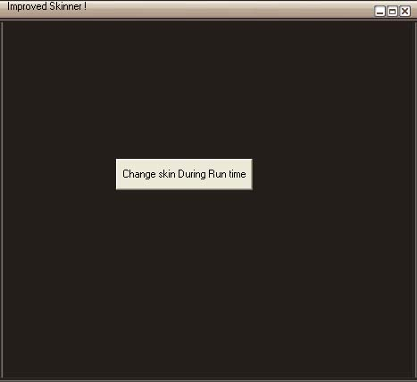

<div align="center">

## VB Skinner


</div>

### Description

The Code consist of Activex Controller used for skinning a form . It provides good style and is based to work on vbskinner's skins.This is a reloaded version and now supports faster skinning and skin resizing . If u tried my earlier version , you definitely got to try this again ! Although menus are not compatable now .. i will try to add it later versions ! Enjoy
 
### More Info
 
skinned forms

the user may not be able to use the menu options instead they can try smart xp menus


<span>             |<span>
---                |---
**Submitted On**   |2005-08-09 00:00:40
**By**             |[Rajeev Punnalil](https://github.com/Planet-Source-Code/PSCIndex/blob/master/ByAuthor/rajeev-punnalil.md)
**Level**          |Intermediate
**User Rating**    |4.7 (14 globes from 3 users)
**Compatibility**  |VB 6\.0
**Category**       |[Custom Controls/ Forms/  Menus](https://github.com/Planet-Source-Code/PSCIndex/blob/master/ByCategory/custom-controls-forms-menus__1-4.md)
**World**          |[Visual Basic](https://github.com/Planet-Source-Code/PSCIndex/blob/master/ByWorld/visual-basic.md)
**Archive File**   |[VB\_Skinner193083982005\.zip](https://github.com/Planet-Source-Code/rajeev-punnalil-vb-skinner__1-62467/archive/master.zip)

### API Declarations

```
Private Declare Function GetPixel Lib "gdi32" (ByVal hdc As Long, ByVal X As Long, ByVal Y As Long) As Long
Private Declare Function ReleaseCapture Lib "user32" () As Long
Private Declare Function SendMessage Lib "user32" Alias "SendMessageA" (ByVal hwnd As Long, ByVal wMsg As Long, ByVal wParam As Long, lParam As Any) As Long
```


